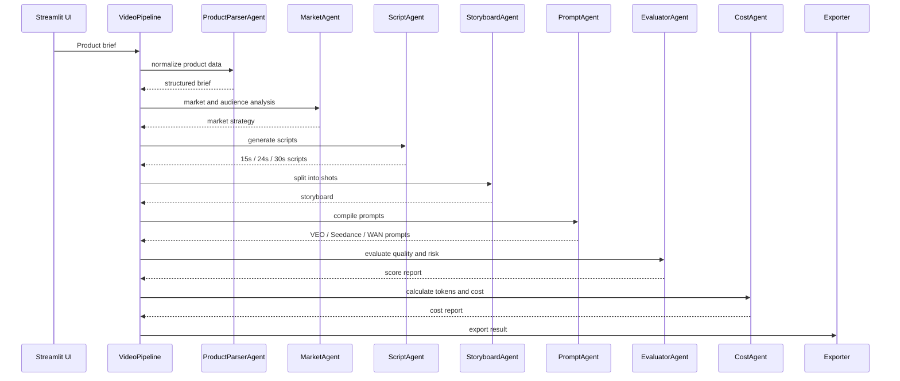

# Architecture

本项目采用轻量级多 Agent 架构，不依赖 LangChain / CrewAI 等重型框架，核心目标是让审核者能清楚看到：

- Agent 分工明确
- 工作流可追踪
- 输出可验证
- Token 消耗可统计
- 可接入 OpenAI-compatible API

---

## Workflow

---

## Design Principles

### 1. One Agent, One Responsibility

每个 Agent 只解决一个环节，避免一个大 Prompt 把所有任务混在一起。

### 2. Structured Output First

所有 Agent 都输出 dict/list 结构，便于导出 JSON、CSV、Excel，也便于后续接入 RPA 或前端页面。

### 3. Demo Mode and Live Mode

- Demo Mode：不需要 API Key，使用内置规则生成稳定输出，方便演示。
- Live Mode：使用 OpenAI-compatible Chat Completions API，便于接入 MiMo、DeepSeek、OpenRouter 等模型。

### 4. Trace Everything

每个 Agent 运行都会记录：

- agent name
- input summary
- output summary
- prompt tokens estimate
- completion tokens estimate
- latency
- status

这些信息可以作为 Token Plan 申请证明材料。

---

## Extension Plan

后续可以扩展：

1. 接入图片理解 Agent：根据商品图自动提取外观、颜色、功能点。
2. 接入 RPA：自动把 Prompt 投递到视频生成平台。
3. 接入素材管理：自动管理产品图、模特图、背景图、成片。
4. 接入 A/B 测试：根据投放数据反向优化脚本模板。
5. 接入团队任务分发：将生成方案分配给不同执行人员。
