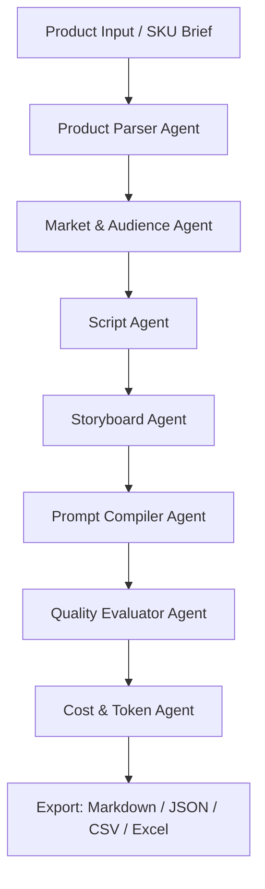

# AI Short Video Factory Agent

> Cross-border e-commerce short-video multi-agent production workflow.  
> 中文名：跨境电商 AI 带货视频多 Agent 生产系统。

这个项目用于把一个产品 Brief 自动转化为：

- TikTok 带货脚本
- 15s / 24s / 30s 短视频方案
- 可执行分镜表
- VEO / Seedance / WAN 视频生成提示词
- AI 生成风险评估
- 质量评分
- Token 与成本估算
- Markdown / JSON / CSV / Excel 导出文件

项目定位不是普通聊天机器人，而是一个面向真实业务链路的 **multi-agent workflow**，适合用于申请大模型 Token Plan、展示 Agent 架构能力、证明高频 Token 消耗场景。

---

## 1. 业务背景

跨境电商短视频生产中，运营给到的产品资料通常不标准：有时只有商品图，有时只有一句卖点，有时目标市场、用户画像、视频时长、镜头风格都不明确。人工从产品资料整理、脚本创作、分镜拆解、视频模型提示词编写到质量评估，需要反复沟通，导致团队产能不稳定、内容质量波动大。

本项目通过多个 Agent 协作，将产品资料转化为可直接执行的短视频生产方案，降低人工提示词编写成本，并让不同组员按照统一标准产出内容。

---

## 2. Agent 架构



### Agent 列表

| Agent | 作用 | 输出 |
|---|---|---|
| Product Parser Agent | 解析产品资料、标准化卖点、提取限制条件 | product brief |
| Market Agent | 根据目标国家和用户画像制定内容方向 | market strategy |
| Script Agent | 生成 15s / 24s / 30s TikTok 带货脚本 | scripts |
| Storyboard Agent | 将脚本拆成镜头、景别、动作、转场 | storyboard |
| Prompt Agent | 生成 VEO / Seedance / WAN / Image prompt | prompts |
| Evaluator Agent | 评估镜头可执行性、卖点清晰度、AI 风险 | score report |
| Cost Agent | 统计输入/输出 Token 和预估成本 | cost report |

---

## 3. 快速开始

### 3.1 安装依赖

```bash
pip install -r requirements.txt
```

### 3.2 Demo 模式运行

不需要 API Key，直接使用内置规则模拟多 Agent 工作流：

```bash
streamlit run app.py
```

或者命令行运行：

```bash
python scripts/run_demo.py --sample samples/tshirt_product.json
```


示例导出结果已经放在 `demo_outputs/`，可以作为 GitHub 页面展示素材；真实运行生成的文件会进入 `outputs/`。

运行后会在 `outputs/` 目录生成：

- `result.json`
- `result.md`
- `storyboard.csv`
- `prompts.csv`
- `trace.json`
- `result.xlsx`（如果本地安装了 openpyxl）

### 3.3 接入 OpenAI-compatible API

复制环境变量模板：

```bash
cp .env.example .env
```

填写：

```env
LLM_PROVIDER=openai_compatible
OPENAI_COMPATIBLE_BASE_URL=https://api.example.com/v1
OPENAI_COMPATIBLE_API_KEY=your_api_key
OPENAI_COMPATIBLE_MODEL=your-model-name
```

如果使用 MiMo / DeepSeek / OpenRouter / 其他兼容 OpenAI Chat Completions 的模型，只需要替换 base url、api key 和 model name。

---

## 4. 示例输入

```json
{
  "product_name": "POV Oversized T-shirt",
  "category": "fashion",
  "target_market": "Indonesia",
  "target_audience": "18-30 young TikTok users",
  "selling_points": [
    "oversized streetwear fit",
    "soft cotton fabric",
    "bold front print",
    "easy to match with jeans and cargo pants"
  ],
  "video_goal": "TikTok conversion short video",
  "preferred_style": "streetwear OOTD, realistic model, fast rhythm",
  "constraints": [
    "avoid complex cloth tearing interaction",
    "avoid exaggerated body deformation",
    "9:16 vertical video"
  ]
}
```

---

## 5. 为什么这个项目适合 Token Plan 申请

这个项目具备三个特点：

1. **真实业务场景**：跨境电商短视频生产链路长，脚本、分镜、提示词、质检都需要持续调用模型。
2. **多 Agent 协作**：不是单次问答，而是多个 Agent 串联，每个节点都有明确输入和输出。
3. **高频 Token 消耗**：每个 SKU 都会触发产品分析、市场定位、脚本生成、分镜生成、Prompt 编译和质量评估，适合批量化生产。

---

## 6. Demo 录屏建议

录一个 1-2 分钟视频：

1. 打开 Streamlit 页面。
2. 选择 T-shirt 示例产品。
3. 点击 `Run Agent Workflow`。
4. 展示 Agent Trace 日志。
5. 展示脚本、分镜、模型提示词、评分报告。
6. 展示导出的 Markdown / JSON / CSV 文件。

具体脚本见：`docs/demo_recording_script.md`

---

## 7. 隐私与脱敏

项目中的产品、市场、价格、客户信息均为脱敏样例。真实业务使用时，应避免上传客户名称、订单数据、内部报价、供应链价格等敏感信息。

---

## 8. License

MIT License.
